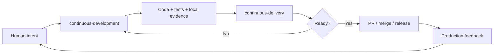

# HOW_TO_USE.md

This file explains how to use the Agent Driven Development foundation in real projects.

The goal is not to make an AI agent “do everything.” The goal is to make the agent work inside a repeatable engineering loop that produces high-quality code, meaningful tests, clear evidence, and production-ready changes.

## Core idea

Use agents as workflow executors, not magic builders.

Give the agent global project context once, then build software through small, reviewable vertical slices.

The standard loop is:



In normal feature work:

1. Start with one clear task.
2. Ask the agent to plan first.
3. Approve or correct the plan.
4. Let the agent implement using `continuous-development`.
5. Let a fresh agent/session verify using `continuous-delivery`.
6. Merge only when tests, evidence, and CI pass.

## File roles

| File or folder | Audience | Purpose |
|---|---|---|
| `README.md` | Humans | Explains what the project/repo is |
| `HOW_TO_USE.md` | Humans | Explains how to use the agent workflow |
| `AGENTS.md` | Agents | Repo-specific rules, commands, constraints, and workflow routing |
| `DESIGN.md` | Humans + agents | Visual identity, design tokens, UI rules, and design constraints |
| `docs/architecture.md` | Humans + agents | Architecture source of truth |
| `docs/testing.md` | Humans + agents | Testing policy source of truth |
| `skills/continuous-development/SKILL.md` | Agents | How to produce high-quality code and tests |
| `skills/continuous-delivery/SKILL.md` | Agents | How to verify readiness, evidence, CI, and release safety |
| `.github/workflows/ci.yml` | CI/CD | Machine-enforced checks |
| `.github/PULL_REQUEST_TEMPLATE.md` | Humans + agents | Evidence checklist for changes |

The short version:

- `AGENTS.md` tells agents how to behave in this repo.
- `DESIGN.md` tells agents how the product should look and feel.
- `docs/architecture.md` tells agents how the system is built.
- `docs/testing.md` tells agents how correctness is proven.
- `continuous-development` builds.
- `continuous-delivery` verifies.
- CI enforces.

## How to start a new project

After copying the base files into a new repository, do not ask the agent to build features immediately.

Start by adapting the foundation to the project.

Use this prompt:

```md
We are starting a new project.

First, do not implement product features yet.

Read the existing repository files and the Agent Driven Development foundation:
- AGENTS.md
- DESIGN.md
- docs/architecture.md
- docs/testing.md
- skills/continuous-development/SKILL.md
- skills/continuous-delivery/SKILL.md

Your task is to adapt these files to this specific project.

Project overview:
[describe the product]

Target users:
[describe the users]

Main product goals:
[list goals]

Preferred stack:
[list stack]

Design direction:
[describe brand/design direction]

Output:
1. Update AGENTS.md for this project.
2. Update DESIGN.md for this project.
3. Update docs/architecture.md with the initial architecture.
4. Update docs/testing.md with the initial testing policy and commands.
5. Do not implement features yet.
6. At the end, summarize assumptions and open questions.
```

After the agent produces the first version, review these files yourself before feature work begins.

## How to add this foundation to an existing project

For an existing repository, start with an onboarding/audit step.

Use this prompt:

```md
We are adding the Agent Driven Development foundation to this existing project.

Do not implement product features yet.
Do not refactor code during this step.
Do not add new frameworks during this step.

Read the repository and infer the current architecture, stack, commands, testing setup, conventions, and risks.

Then update or create:
- AGENTS.md
- DESIGN.md, if this project has UI
- docs/architecture.md
- docs/testing.md

Rules:
- Document the current reality first.
- Do not invent architecture that does not exist.
- Mark unclear or missing areas as "needs confirmation."
- Keep the docs short, practical, and specific to this repo.

At the end, give me:
1. Current architecture summary.
2. Current testing/CI summary.
3. Gaps and risks.
4. Recommended next changes.
```

Only after that should the agent begin implementing features.

## Normal feature workflow

For normal work, give the agent one feature, bug fix, or optimization at a time.

Use this prompt shape:

```md
Implement this feature using the Agent Driven Development workflow.

## Task

[one clear feature]

## Context

[why this matters]

## User story

As a [user], I want [capability], so that [benefit].

## Acceptance criteria

- [observable behavior]
- [observable behavior]
- [observable behavior]

## Non-goals

- Do not [thing]
- Do not [thing]

## Constraints

- Follow AGENTS.md.
- Follow DESIGN.md for UI changes.
- Follow docs/architecture.md.
- Follow docs/testing.md.
- Use the continuous-development skill first.
- After implementation, use the continuous-delivery skill for verification.

## Implementation notes

[only include important technical details]

## Expected evidence

- Tests added or updated.
- Relevant commands run.
- Screenshots for UI changes.
- Docs updated if architecture, testing, or design changed.
- PR summary and rollback notes.
```

For non-trivial work, ask for a plan before coding.

```md
Use continuous-development planning mode.

Do not edit files yet.

Read the relevant files and produce:
1. Understanding of the task.
2. Existing patterns found.
3. Files likely to change.
4. Test plan.
5. Implementation plan.
6. Risks and assumptions.

Wait for approval before implementation.
```

Then, after reviewing the plan:

```md
Proceed with implementation using the approved plan.

Keep the diff minimal.
Create or update the required tests.
Run the relevant checks.
Update docs only if the project truth changed.
Then prepare delivery evidence.
```

## How much context to give the agent

Give global context once. Build feature by feature.

Good global context includes:

- product goal
- target users
- business rules
- preferred stack
- design direction
- important constraints
- security requirements
- deployment assumptions

Do not ask the agent to implement the full product from a broad idea.

Avoid prompts like:

```md
Build the whole CRM with auth, dashboard, customers, invoices, reporting, billing, settings, and admin.
```

Prefer small vertical slices:

```md
Implement customer creation.

Acceptance criteria:
- A signed-in user can create a customer with name, phone, email, and company name.
- Invalid input shows validation errors.
- Successful creation redirects to the customer detail page.
- The customer list updates after creation.
- Empty, loading, and error states are handled.
```

## How to give technical patterns

Tell the agent exact coding patterns when the pattern matters.

If a pattern is reusable, store it in `docs/architecture.md` or `docs/testing.md` so you do not need to repeat it.

For example, do not repeat this in every prompt forever:

```md
For TanStack Query with TanStack Start:
- Route loaders should prefetch data with queryClient.ensureQueryData.
- Components should consume prefetched data with useSuspenseQuery where appropriate.
- Query keys should be defined near the domain or service they represent.
- Mutations should invalidate or update affected query keys explicitly.
```

Instead, add it to `docs/architecture.md` under a stable frontend data-loading pattern.

Use this rule:

| Type of instruction | Where it belongs |
|---|---|
| Permanent project pattern | `docs/architecture.md` |
| Permanent testing rule | `docs/testing.md` |
| Permanent agent behavior rule | `AGENTS.md` |
| Permanent design rule | `DESIGN.md` |
| One-time feature constraint | The feature prompt |
| Workflow behavior | `skills/*/SKILL.md` |

## UI and frontend design workflow

For UI work, use the `ui-change` mode inside `continuous-development`.

Use this prompt:

```md
Implement this UI change using the ui-change mode of continuous-development.

Before coding:
1. Read DESIGN.md.
2. Inspect existing screens/components.
3. Identify which @ravenopsnet/ui components should be used.
4. Describe the layout, hierarchy, states, and responsive behavior.
5. Do not code until the UI plan is clear.

## UI requirements

- [describe page/section]
- [describe primary action]
- [describe data shown]
- [describe empty/loading/error states]
- [describe mobile behavior]

## Avoid

- Generic SaaS layout.
- Random accent colors.
- New one-off components when @ravenopsnet/ui already has a suitable primitive.
- Redesigning unrelated screens.

## After implementation

- Provide desktop and mobile screenshots if possible.
- Verify against DESIGN.md.
- Run relevant tests.
- Prepare delivery evidence.
```

For UI work, the agent should implement all relevant states:

- loading
- empty
- error
- success
- disabled
- validation
- mobile/responsive behavior
- keyboard/focus behavior where relevant

## Bug fix workflow

Bug fixes should be test-first.

Use this prompt:

```md
Fix this bug using the continuous-development bugfix mode.

## Bug

[describe bug]

## Expected behavior

[describe expected behavior]

## Observed behavior

[describe actual behavior]

## Steps to reproduce

1. ...
2. ...
3. ...

## Rules

- First create a failing regression test that reproduces the bug.
- Then implement the minimal fix.
- Do not refactor unrelated code.
- Run the relevant tests.
- Use continuous-delivery verification before declaring done.
```

If the agent cannot reproduce the bug, it should say so and explain what evidence is missing.

## Refactor workflow

Refactors should have narrow scope.

Use this prompt:

```md
Refactor this area using continuous-development refactor mode.

## Goal

[what should improve]

## Scope

[files/modules allowed]

## Non-goals

- No behavior changes.
- No UI changes.
- No schema changes.
- No dependency changes unless explicitly required.

## Rules

- Add characterization tests first if behavior is not already covered.
- Keep public APIs compatible unless explicitly approved.
- Make the smallest safe refactor.
- Run all relevant tests.
- Use continuous-delivery verification before declaring done.
```

Do not combine refactors with unrelated feature work unless there is a strong reason.

## Architecture change workflow

Architecture changes should start with analysis, not code.

Use this prompt:

```md
We need to evaluate an architecture change.

Do not implement yet.

Read:
- AGENTS.md
- docs/architecture.md
- docs/testing.md
- relevant code

## Proposal

[describe architecture change]

## Produce

1. Current architecture summary.
2. Proposed architecture.
3. Migration plan.
4. Impacted modules.
5. Test strategy.
6. Risks.
7. Alternatives.
8. Recommendation.

If the recommendation is accepted, update docs/architecture.md first, then implement in small PRs.
```

Architecture changes should usually be split into several small PRs.

## Database change workflow

Database changes require extra care.

Use this prompt:

```md
Implement this database change using continuous-development db-change mode.

## Change

[describe schema/data change]

## Requirements

- Update the schema in the correct package/module.
- Create the migration.
- Add or update migration tests if supported by this repo.
- Preserve existing data.
- Update domain schemas/types if needed.
- Update docs/architecture.md if the data model or ownership changed.
- Use continuous-delivery verification before declaring done.

## Risk areas

- Backward compatibility.
- Existing production data.
- Rollback strategy.
- API contracts using this data.
```

Never treat migrations as simple code changes.

## Security-sensitive workflow

Security-sensitive changes include auth, permissions, sessions, secrets, input validation, data access, billing, webhooks, and user roles.

Use this prompt:

```md
Implement this security-sensitive change using continuous-development security mode.

## Change

[describe change]

## Required checks

- Identify affected trust boundaries.
- Identify affected roles/permissions.
- Add permission or exploit regression tests where relevant.
- Do not weaken validation to make tests pass.
- Do not expose secrets or internal identifiers.
- Update docs/architecture.md or docs/testing.md if policy changed.
- Use continuous-delivery security verification before declaring done.
```

Security changes should receive stricter review than normal UI or internal refactors.

## Delivery verification workflow

After implementation, run verification separately when possible.

Use a fresh agent session or a different model if available.

```md
Use continuous-delivery verification mode.

Review this change as if you are the release verifier, not the implementer.

Check:
- Acceptance criteria.
- Tests added or updated.
- Test output.
- Typecheck/lint/build.
- Architecture compliance.
- DESIGN.md compliance if UI changed.
- Security and permission impact.
- Database migration safety.
- Rollback plan.
- Missing evidence.

Return:
1. Pass/fail.
2. Blocking issues.
3. Non-blocking issues.
4. Required fixes before merge.
5. Final PR summary.
```

The verifier should try to prove the change is wrong. It should not simply praise the implementation.

## What the human should review

Do not try to manually review every line of a large diff.

Review the high-leverage things:

1. Plan
2. Acceptance criteria
3. Files changed
4. Architecture changes
5. Data model changes
6. Permission/security logic
7. Test plan
8. Test evidence
9. UI screenshots
10. CI result
11. PR summary
12. Rollback plan

Your job is to review intent, risk, and evidence.

The workflow should make bad code hard to ship quietly.

## How to steer the agent

Use these steering tools.

### Acceptance criteria

Acceptance criteria should be observable.

Good:

```md
- A signed-in user can create a customer.
- Invalid phone numbers show a validation error.
- Successful creation redirects to the customer detail page.
```

Weak:

```md
- Make customer creation good.
- Improve the UX.
```

### Non-goals

Non-goals prevent scope creep.

```md
Non-goals:
- Do not build import/export.
- Do not add customer tags.
- Do not redesign the dashboard.
- Do not change the auth system.
```

### Scope boundaries

Tell the agent where changes are expected.

```md
Expected areas:
- apps/web/src/routes/customers/
- apps/core/src/customers/
- packages/domain/src/customer.ts
- packages/db/src/schema/customers.ts

Avoid unrelated changes.
```

### Risk focus

Tell the agent what could go wrong.

```md
Risk areas:
- Validation must match frontend and backend.
- Only authenticated users can create customers.
- Database migration must preserve existing data.
- Do not expose internal-only fields.
```

## When to update project memory

The agent should update project files when the project truth changes.

| If this changes | Update |
|---|---|
| Agent workflow rule | `AGENTS.md` |
| Visual identity, design tokens, UI rules | `DESIGN.md` |
| Architecture, module boundaries, data ownership | `docs/architecture.md` |
| Test commands, testing policy, CI expectations | `docs/testing.md` |
| Build/test/release enforcement | `.github/workflows/ci.yml` |
| PR evidence expectations | `.github/PULL_REQUEST_TEMPLATE.md` |
| How agents should execute work | `skills/*/SKILL.md` |

Agents may draft updates, but humans should approve changes to principles, architecture, stack, testing policy, security policy, or delivery rules.

## How to improve the workflow over time

When the workflow fails, improve the system.

| Failure | Improve |
|---|---|
| Agent repeats the same mistake | `AGENTS.md` or relevant skill |
| Agent misunderstands architecture | `docs/architecture.md` |
| Agent writes weak tests | `docs/testing.md` and `continuous-development` |
| CI misses a bug | CI workflow and `docs/testing.md` |
| UI keeps drifting | `DESIGN.md` and UI verification rules |
| PR evidence is incomplete | PR template and `continuous-delivery` |
| Production incident happens | Add regression test and update docs/skills if needed |

The goal is for every failure to make the repo smarter.

## Do and do not

Do:

- Give one task at a time.
- Ask for a plan before non-trivial work.
- Use acceptance criteria.
- Use non-goals.
- Keep diffs small.
- Store repeated instructions in project docs.
- Use fresh verification when possible.
- Merge only with evidence.

Do not:

- Ask the agent to build an entire product in one run.
- Let the agent rewrite architecture without approval.
- Accept vague test evidence.
- Allow skipped or weakened tests to pass CI.
- Let UI changes ignore `DESIGN.md`.
- Let generated docs become generic textbook content.
- Treat skills as a replacement for CI.

## Minimal daily loop

Use this loop for day-to-day work:

1. Give the agent one feature, bug, refactor, or optimization.
2. Ask for a plan first.
3. Approve or correct the plan.
4. Let the agent implement using `continuous-development`.
5. Let a fresh verifier run `continuous-delivery`.
6. Fix blocking issues.
7. Merge only after tests, evidence, and CI pass.
8. Update project memory if the change revealed a missing rule.

## The shortest useful feature prompt

When the project docs are mature, your prompt can become short:

```md
Implement customer creation using the standard Agent Driven Development workflow.

Acceptance criteria:
- A signed-in user can create a customer with name, phone, email, and company name.
- Invalid input shows validation errors.
- Successful creation redirects to the customer detail page.
- The customer list updates after creation.
- Empty, loading, and error states are handled.

Non-goals:
- Do not build import/export.
- Do not add customer tags.
- Do not redesign the dashboard.

Use continuous-development first, then continuous-delivery verification.
```

That is the long-term goal: less prompting, more reliable execution.
